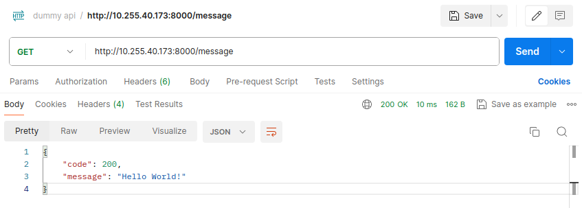
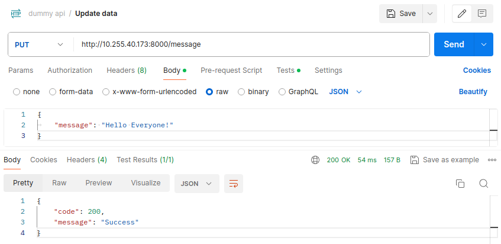
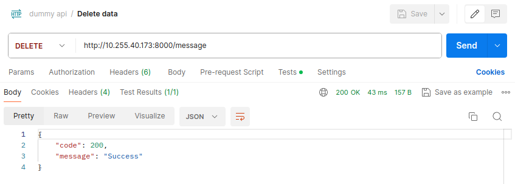

# DummyMessageAPI

For this tutorial, we are going to need a dockerized application. In this example, we are going to use a simple REST API developed using FastAPI that basically returns a current message being stored in memory and allows you to change it, but you should be able to use any other application that you want, as long as it is dockerized.

## Dockerize the application

To dockerize there should be a `Dockerfile` that will define how the docker image should be built, for example for the dummy-message-api application:

```Dockerfile
FROM python:3.12

# Update the packages
RUN apt-get update && apt-get install -y

# Copy the needed files
RUN mkdir -p /app
COPY main.py /app
COPY requirements.txt /app

# Change current directory
WORKDIR /app

# Install requirements
RUN pip install -r requirements.txt

# Expose the port to other containers
EXPOSE 8000

# Run the app
CMD ["fastapi", "run", "main.py", "--port", "8000"]
```

This `Dockerfile` will create a docker image based on the `python:3.12` image, install the needed packages, copy the application files, install the requirements and run the application. This is a very basic example and you should adapt it to your own application.

## Build the image

To build the image you can use the following command:

```bash
docker build -t dummy-message-api:latest .
```

## Push to Registry

To be able to use the image in the Kubernetes cluster, the easiest way is to push it to a registry. To do that you can use the following commands:

```bash
docker tag dummy-message-api:latest <your-registry>/dummy-message-api:latest
docker push <your-registry>/dummy-message-api:latest
```

Replacing `dummy-message-api:latest` with the name and tag of your image and `<your-registry>` with the registry you are using, for example, `docker.io` or a private registry.

## Run the application (Locally)

If you want to try the application locally you can do it using `docker run`. To run the application locally you can use the following command:

```bash
docker run -d -p 8000:8000 dummy-message-api:latest
```

**-d**: Run the container in the background  
**-p 8000:8000**: Map the port 8000 of the host to the port 8000 of the container

## Application Example

The application usage example can be seen below and it is the expected behavior for each of the application packaging steps.

`GET` the current message



`PUT` a new message



`DELETE` the current message


