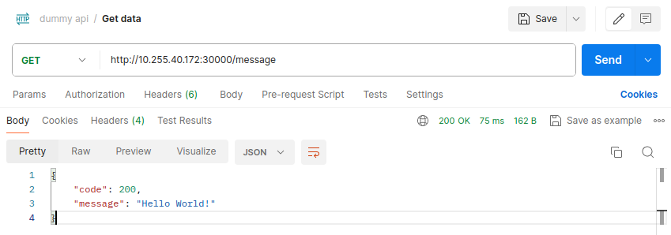

# CNF

For the creation of a CNF, we have 4 principal steps:

1. Create a Dummy VIM Account
2. Add a Kubernetes cluster to OSM linked to the Dummy Vim Account
3. Create the NS/VNF packages
4. Deploy the CNF

## Create a Dummy VIM Account

If you are following this tutorial in Imagine, this will be given to you and you can skip this step.

To create a dummy VIM account, you can use the following command:

```bash
osm vim-create --name <dummy-vim-name> --account_type dummy --auth_url dummy --user dummy --password dummy --tenant dummy
```

Or use the OSM GUI to create a new VIM account.

1. Access the OSM VIM Accounts tab
2. Click on the "New VIM" button


3. Fill the form with the following parameters
4. Click on the "Create" button


5. The VIM account should be created and appear in the list


## Add a Kubernetes cluster to OSM linked to the Dummy Vim Account

If you are following this tutorial in Imagine, this will also be given to you and you can skip this step.

To add a Kubernetes cluster to OSM, you can use the following command:

```bash
osm k8scluster-add <name> --vim <dummy-vim-name> --k8s-nets '{"k8s_net1": "vim_network1", ...}' --description "K3s cluster For ..." --init-helm3 --creds <kubeconfig-file-path> --version <kubernetes-version>
```

Or use the OSM GUI to create a new Kubernetes cluster.

1. Access the OSM k8s Clusters tab
2. Click on the "Add K8s Cluster" button


3. Fill out the form with your parameters
4. Click on the "Create" button

> [!WARNING]
> In the web interface of OSM, the kubernetes cluster credentials must be in JSON format, either in a file or in the text field. Using the command line, the credentials can be in YAML format.


1. The k8s cluster should be created and appear in the list


## Create the NS/VNF packages

To instantiate a CNF in OSM, the process is very similar to the instantiation of a VNF, being the key difference the usage of a KDU (Kubernetes Deployment Unit) instead of a VDU (Virtual Deployment Unit).

The steps to create the packages are the following:

1. Create the packages
2. Add your Helm Charts
3. Configure the descriptors

### Create the packages

To create the packages, you can use the following commands:

```bash
osm package-create vnf <your-application-name>
osm package-create ns <your-application-name>
```

And it should create two packages, one for the NS, named `<your-application-name>_ns`, and one for the VNF, named `<your-application-name>_vnf`. Inside those packages, you will find some folders that are not needed and should be deleted to avoid any confusion and problems. The folders to delete are `Files`, `Scripts` and `Licenses`, this last one only if not needed.

### Add your Helm Charts

#### Option 1: Using Helm chart directly

This is the option that is going to be used in Imagine.

OSM is ready to receive Helm Charts as part of the packages, but they need to be placed in the correct directory. For it, create a folder named `helm-chart-v3s` inside the VNF package folder.

```bash
mkdir <your-application-name>_vnf/helm-chart-v3s
```

And then, you can put the previously created Helm Chart inside this folder.

#### Option 2: Using a Helm Repository

OSM also supports Helms Charts from repositories. If your helm chart is in a helm repository, you need to add it to OSM before referencing it.

```bash
osm repo-add --type helm-chart --description "Helm repo description" --user <user-if-not-public-repo> --password <password-if-not-public-repo> <repo-name> <repo-url>
```

If the Helm Chart is in a public repository, you should not pass the `--user` and `--password` flags.

### Configure the descriptors

Configuring the descriptors is the most tricky part of the process, as it might require some knowledge of the OSM descriptors. For simple applications this guide must be enough, but for more complex applications with some extra requirements, it might be necessary to check the OSM documentation.

#### NS Descriptor

To launch a CNF, the NS descriptor does not need a lot of changes from the default one. In fact, you can simply leave the default one and it should work, but you might want, atlist, to edit the `name`, `designed`, `description` and `version` to better describe your application.

Here's an example:

```yaml
nsd:
  nsd:
  - id: <your-application-name>_nsd
    name: <your-application-name>_nsd
    designer: IT
    description: <your-application-name> CNF NS
    version: '1.0'
    vnfd-id:
    - <your-application-name>_vnfd
    df:
    - id: default-df
      vnf-profile:
      - id: "1"
        vnfd-id: <your-application-name>_vnfd
        virtual-link-connectivity:
        - virtual-link-profile-id: mgmtnet
          constituent-cpd-id:
          - constituent-base-element-id: "1"
            constituent-cpd-id: mgmtnet-ext
    virtual-link-desc:
    - id: mgmtnet
      mgmt-network: true
```

#### VNF Descriptor

The VNF descriptor is where you will define the Helm Chart(s) that will be used in the deployment of the CNF. The default VNF descriptor is very connected to the creation of VDUs and not KDUs, so it is necessary to change it to adapt to the new reality.

I would recommend using the following VNF descriptor as a starting point:

```yaml
vnfd:
  id: <your-application-name>_vnfd
  product-name: <your-application-name>_vnfd
  description: Your CNF description
  provider: OSM
  version: '1.0'
  mgmt-cp: mgmtnet-ext
  df:
  - id: default-df
  k8s-cluster:
    nets:
      - id: mgmtnet
  kdu:
  - name: <your-application-name>-kdu
    helm-chart: <your-helm-chart-folder-name>
    helm-version: v3
  ext-cpd:
    - id: mgmtnet-ext
      k8s-cluster-net: mgmtnet
```

If you kept the default values of the NS descriptor, you should only need to change the `id` to match your NS descriptor parameters, even though you might also want to change the `product-name`, `description`, `provider` and `version` to better describe your application.

To use the helm chart previously added, you should change the `helm-chart` parameter in the `kdu` section to match the name of the folder that contains the helm chart previously added.

> [!WARNING]
> If you are using a Helm Chart from a repository, you should change the `helm-chart` parameter to match the name given of the repository and the helm chart itself. For example:
> ```yaml
> helm-chart: <repo-name>/<your-helm-chart-name>
> ```

This way, you should have a CNF ready to be deployed with OSM.

## Deploy the CNF

You are only two steps away from deploying your CNF in OSM. The first step is to upload the packages to OSM and the second is to deploy the NS.

### Upload the packages to OSM

To upload the packages to OSM, you can use the following commands:

```bash
osm nfpkg-create <your-application-name>_vnf/
osm nspkg-create <your-application-name>_ns/
```

### Deploy the CNF

To deploy the CNF you can then use the following command:

```bash
osm ns-create --ns_name <your-application-name>_cnf --nsd_name <your-application-name>_nsd --vim_account <k8s-vim-name-or-id>
```

And your CNF should be deployed in the kubernetes cluster.

#### Additional Parameters

If you need to pass additional parameters to the CNF, you can use the `--config` flag to pass a JSON with them or use the `--config_file` flag to pass a YAML file with the parameters. The parameters that can be passed to the CNF are the Kubernetes `namespace` to be used by the CNF, custom VNF variables, and values to be passed to the Helm Chart (similar to the --set flag in Helm).

For example, to pass a namespace named `custom-namespace` to the CNF and change the service nodePort to 30000, of the base application (your might differ), you can deploy the CNF using the following command:

```bash
osm ns-create --ns_name <your-application-name>_cnf --nsd_name <your-application-name>_nsd --vim_account <k8s-vim-name-or-id> --config '{
  "additionalParamsForVnf": [
    {
      "member-vnf-index": "1",
      "additionalParamsForKdu": [
        {
          "kdu_name": "<your-application-name>-kdu",
          "k8s-namespace": "<custom-namespace>",
          "additionalParams": {
            "service": {
                "nodePort": 30000
            }
          }
        }
      ]
    }
  ]
}'
```

## Check the deployment

After deploying the CNF, using any of the methods above, you can check the status of the deployment and it should be similar to the following:


If you run the first command, you should have something like the following in your kubernetes cluster:


As you can see, the CNF is running in a namespace created by OSM and is using the default Helm Chart NodePort used which is 30100.

If you run the second command, you should have something like the following in your kubernetes cluster:


As you can see, the CNF is using a custom namespace, that I named `custom-namespace`, and is using the custom NodePort 30000.

And that's it! You have a CNF running in your Kubernetes cluster using OSM.

You can test your application, and it should be working as expected:




